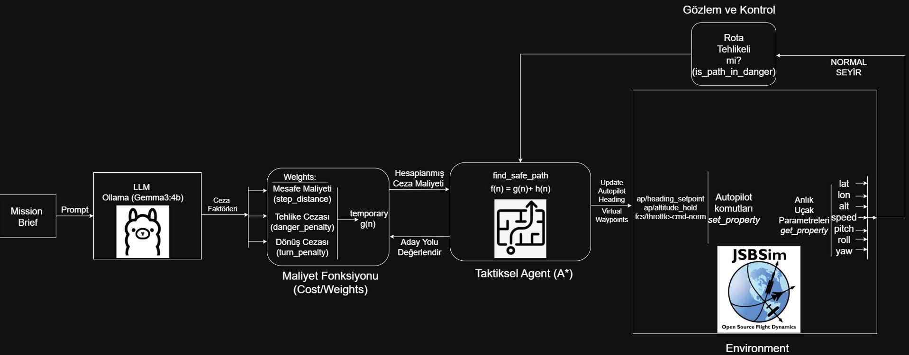
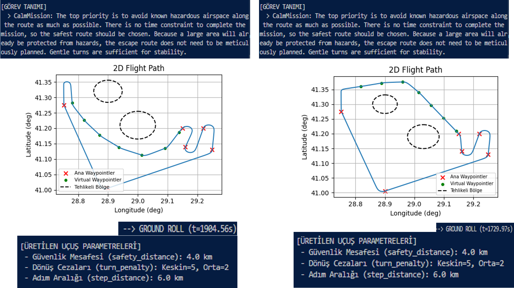
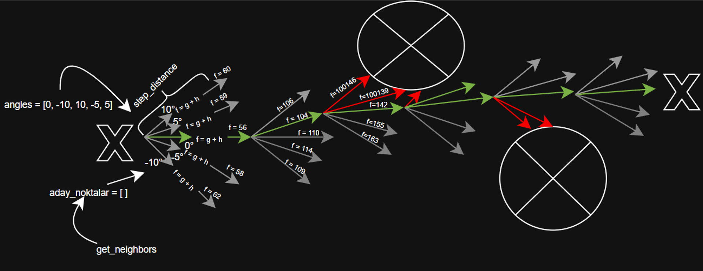
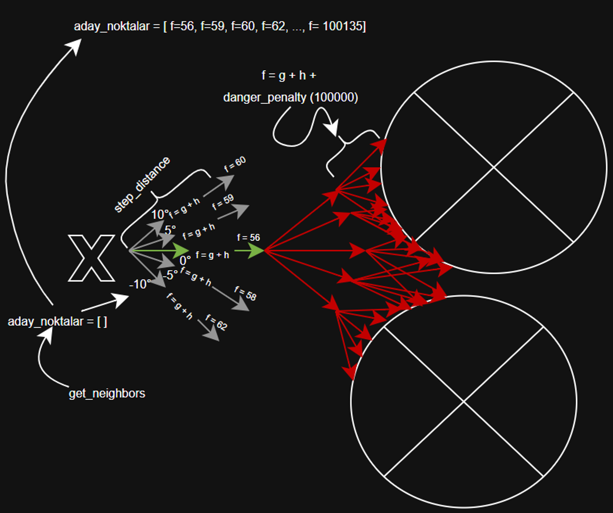
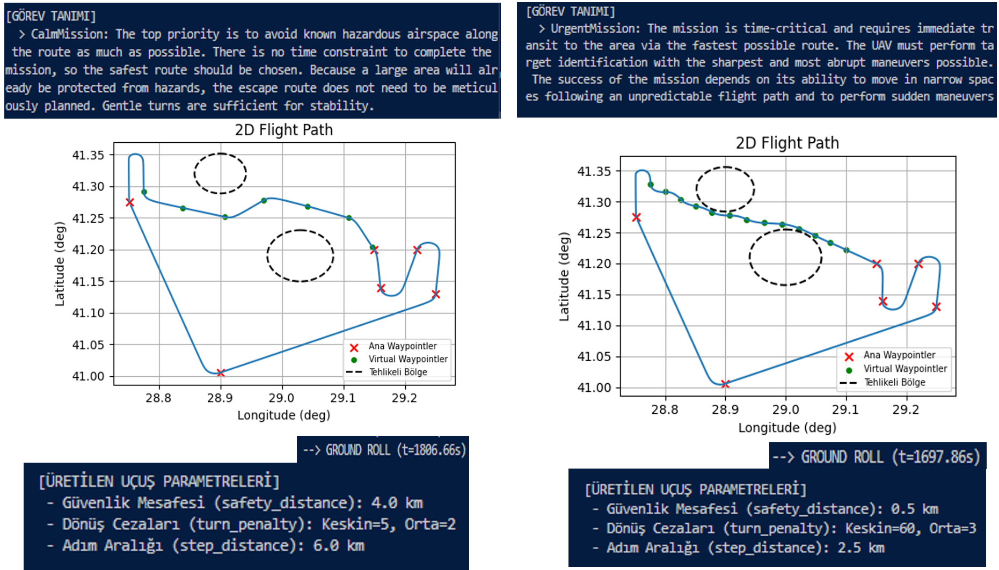
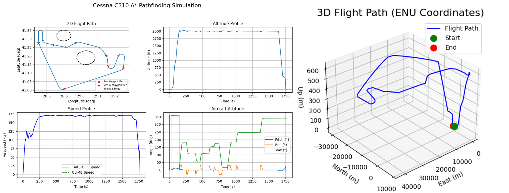

# LLM-Based Strategic Mission Planning and Autonomous Flight Simulation with A* Algorithm

## Project Overview
I developed an autonomous flight simulation pipeline that utilizes a Large Language Model (LLM) as a strategic decision-maker. By processing mission briefings written in natural language, the system determines optimal tactical parameters. These parameters then dynamically guide an A* path planning algorithm and a JSBSim-based flight dynamics engine, effectively bridging high-level human intent with low-level autonomous execution.

## Technology Stack
* **Core Language:** Python 3.8+
* **Strategic AI:** Ollama Framework, Google Gemma3:4b
* **Flight Dynamics Engine:** JSBSim (Professional-grade FDM)
* **Navigation:** A* Algorithm (Geodesic)
* **Data Visualization:** Matplotlib, NumPy

## Installation and Setup

### 1. Prerequisites
Ensure you have Python 3.8 or higher installed on your system.

### 2. Install Dependencies
```bash
git clone [https://github.com/YourUsername/YourRepositoryName.git](https://github.com/YourUsername/YourRepositoryName.git)
cd YourRepositoryName
pip install jsbsim geopy matplotlib numpy ollama
```

### 3. Set Up Ollama (Strategic AI)
Download and install [Ollama](https://ollama.com/), start the service, and pull the model:
```bash
ollama pull gemma3:4b
```

### 4. Configure JSBSim
Update the `sim_path` in `main.py` (line ~13) to point to your local JSBSim root directory:
```python
flight_parameters = {
    'sim_path': r'C:\path\to\your\jsbsim-master',
    # ...
}
```

## System Architecture

The project follows a hierarchical architecture where the mission's strategic context is translated step-by-step into physical flight maneuvers.



### 1. Strategic Decision Making & Cost Definition
I implemented the Gemma3:4b LLM as the cognitive layer. Based on the input prompt (e.g., "Safe" vs. "Urgent"), the AI dynamically selects three core parameters within specific ranges to define the trajectory's "cost" logic:

* **Safety Distance:** Defines the mandatory buffer zone around hazardous areas.
* **Sharp Turn Factor:** A high penalty for aggressive maneuvers (for calm missions) or low penalty (for urgent missions).
* **Moderate Turn Factor:** Fine-tunes the smoothing of the route.

The AI evaluates the mission brief and generates these numerical constraints to match the mission's intent.



### 2. Path Planning & Re-Routing (A*)
The A* algorithm remains idle until a "Dangerous Zone" is detected on the direct path. Once triggered, it calculates the most efficient route by minimizing the total cost (Distance + Turn Penalties + Hazard Proximity).

* **A* Grid Logic:** Illustrates the fundamental heuristic-based node evaluation and search area.



* **Dynamic Re-Routing:** Demonstrates how the algorithm calculates an escape path when encountering a "dead end" or a high-risk obstruction, ensuring the safety distance is maintained.


### 3. Flight Execution (JSBSim Dynamics)
Unlike simplified simulations, I integrated **JSBSim** to handle the core flight physics. This ensures the aircraft flies according to real physical constraints (lift, drag, thrust, and gravity).

The simulation follows a complete mission profile controlled via an integrated autopilot:
* **Ground & Takeoff:** The aircraft starts from the runway and handles the climb phase.
* **Cruise (Mission Action):** This is the core phase where all strategic logic and waypoint navigation happen. The autopilot steers the aircraft through the high-precision A* waypoints while maintaining aerodynamic stability.
* **Descent:** The aircraft transitions to the landing phase once it reaches the final destination.



### 4. 3D Visualization and Telemetry
To validate the system's performance, I used Matplotlib to visualize the flight data:
* **3D Flight Path:** Provides a comprehensive spatial view of the mission trajectory.
* **Telemetry Profiles:** Real-time logging of **Altitude, Speed, and Attitude** (Pitch, Roll, Yaw) profiles, showing the aircraft’s physical response during various mission phases.
* **Hazard Awareness:** Dangerous areas are highlighted, allowing for a clear comparison between the planned safety margins and the actual trajectory.



## Limitations and Approximations
* **Static Hazard Handling:** Optimized for static circular boundaries; dynamic 3D obstacles are not yet implemented.
* **Inference Latency:** Responsiveness is tied to the local LLM's inference speed.
* **Autopilot Tuning:** High-speed maneuvers in JSBSim require fine-tuned PID coefficients to prevent instability.
